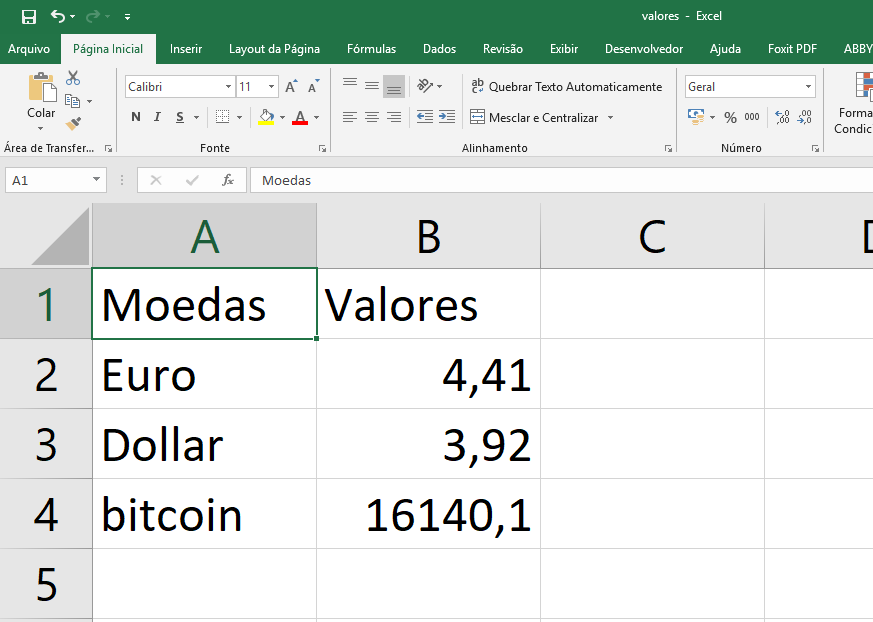

# Um script para pegar os valores, via requisição web, das cotações das principais moedas mundiais:

	-Dollar
	-Euro
	-Bitcoin

API utilizada: [FIXER.IO](http://fixer.io/)

### Biblioteca para funcionamento do script

```sh
pip install requests
pip install json
pip install pandas
```
### Arquivo gerado


### Desenvolvedor

	-Bruno Santos

License

*Free Software!*